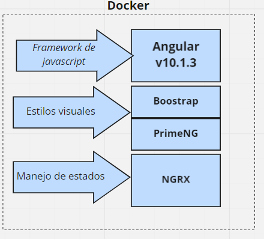
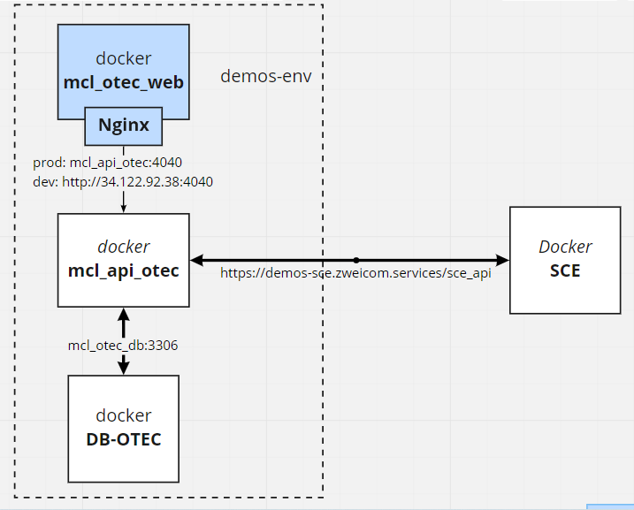

# Project SIGO WEB 0.1.0

Password: M0v15tar.

## Tecnologías



## Ambiente actual



## Objetivo

El objetivo de es otorgar un administrador web que permita al cliente gestionar las ordenes de trabajo que se realizan en Movistar.

## Funcionalidades

Permite:

- Administración de usuarios
- Administración de cubicaciones
- Administración de Ordenes de trabajo

## Links

- Miro: <https://miro.com/app/board/o9J_lRnu24c=/>
- Repo API-sigo: <https://gitlab.com/zweicom/cl-movistar/sigo/api-sigo>
- Repo Db: <https://gitlab.com/zweicom/databases/databases>
- Repo Env: <https://gitlab.com/zweicom/cl-movistar/sigo/demos-sigo>

## Ejecución

- cd ../angular-project
- npm install
- npm start

<!-- ## Robot e2e
Documentación: https://robotframework.org/robotframework/
### **command**

> ``` robot --variable url:<url de la web a testear> --variable ambiente:ambiente en que se probará> <archivo o directorio de archivos de testing>```
>> ``` robot --variable url:http://localhost:4201 --variable ambiente:visual .```

### sintax
- ```--variable url: ```
- ```--variable ambiente:```:
    - **visual** = Para probar de manera local y poder ver la interfaz de chrome
    - **testing** = Para que no ejecute una intefaz visual. Este ambiente es usado para la pipeline -->
