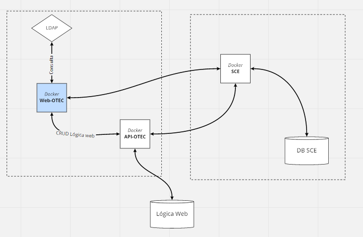
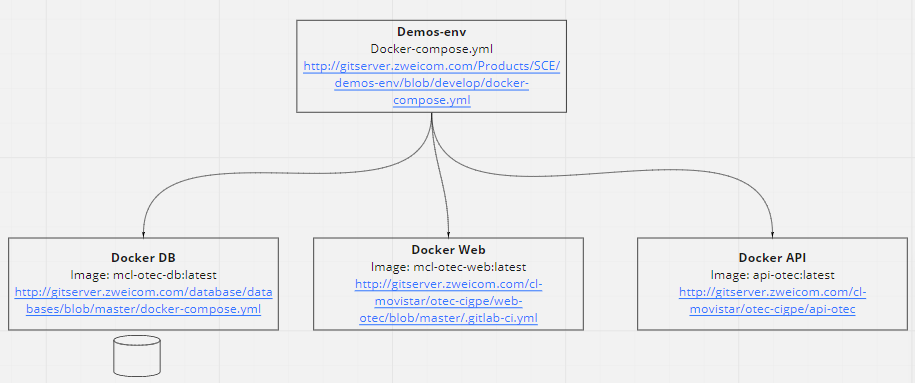

# Project OTEC WEB

## Robot e2e
command

``` robot --variable url:http://localhost:4201 --variable ambiente:visual <archivo o directorio de archivos de testing>```

sintax
```--variable url:<url de la web a testear> ```
```--variable ambiente:<ambiente en que se probará>```: 
    - visual = Para probar de manera local y poder ver la interfaz de chrome
    - testing = Para que no ejecute una intefaz visual. Este ambiente es usado para la pipeline

## Objetivo

El objetivo de es otorgar un administrador web que permita al cliente administrar las ordenes de trabajo que se realizan en Movistar.

## Funcionalidades

Permite:

- Administración de usuarios
- Administración de cubicaciones
- Administración de Ordenes de trabajo

## Tecnologías

- Angular Version:10.1.6 : <https://angular.io/>.
Framework javascript que permite desarrollar grandes y complejas aplicaciones en entorno web. Grafana está desarrollado en angular.

## Arquitectura



## Ambiente



## Links

- Miro: <https://miro.com/app/board/o9J_lRnu24c=/>
- Repo API-Otec: <http://gitserver.zweicom.com/cl-movistar/otec-cigpe/api-otec>
- Repo Db: <http://gitserver.zweicom.com/database/databases/blob/master/docker-compose.yml>
- Repo Env: <http://gitserver.zweicom.com/Products/SCE/demos-env/blob/develop/docker-compose.yml>
- 

## Ejecución

- cd ambiente-local
- docker-compose up -d mcl_api_otec
- cd ../angular-project
- npm install
- npm start

